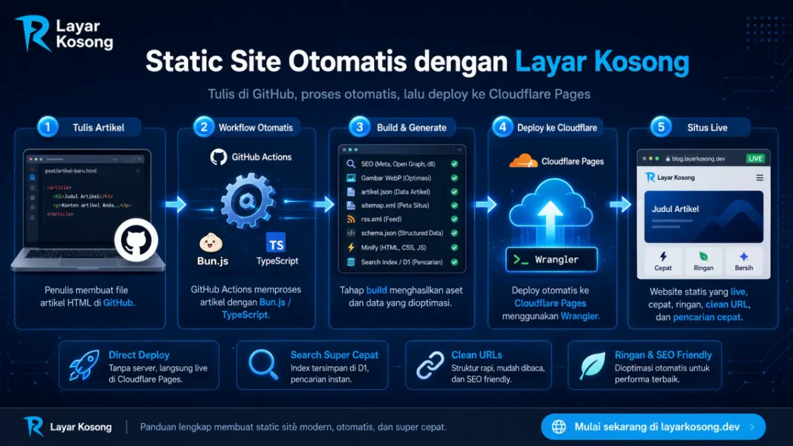

[](https://raw.githubusercontent.com/frijal/LayarKosong/main/sementara/prompt-edan.md)

# 🚀 Panduan Membuat Static Site

[](https://github.com/frijal/LayarKosong/fork)

Selamat datang! Panduan ini akan membantumu membangun situs statis yang super cepat, ringan, dan **otomatis ter-deploy ke Cloudflare Pages** menggunakan *repository* **Layar Kosong**.

Konsepnya: Kamu cukup fokus menulis di GitHub, dan biarkan **GitHub Actions + Cloudflare Wrangler** yang bekerja mengirimkan artikelmu ke internet secara instan.

**Fitur Unggulan:**
* **Direct Deploy:** Menggunakan Wrangler untuk pengiriman kilat tanpa *branch* perantara.
* **Search Engine:** *Client-side JavaScript* super ngebut menggunakan data dari `artikel.json` & Cloudflare D1.
* **Clean URLs:** Mendukung URL tanpa `.html` untuk navigasi yang lebih elegan dan rapi.

---

## 🧠 Arsitektur Otomatisasi (CI/CD)

Penasaran bagaimana "Layar Kosong" memproses draf kasarmu menjadi situs yang *live*? Berikut adalah alur kerja estafet otomatisnya:

```mermaid
graph TD
    %% ==========================================
    %% WORKFLOW 1: 🔄 PROSES ARTIKELX
    %% ==========================================
    subgraph WF1 ["🔄 Workflow 1: Proses ArtikelX (Persiapan Awal)"]
        direction TB
        Start1(((Mulai))) --> Trig1{"Trigger:<br>Push (artikelx/*.html)<br>atau Manual"}
        Trig1 --> Check1["1️⃣ Checkout Repo & Setup Bun.js"]
        
        Check1 --> S_HTML[/"2️⃣ Edit Komponen HTML (Edit-Komponen-HTML.ts)"/]
        S_HTML --> S_Clean[/"3️⃣ Sterilize Schema (clean-schema.ts)"/]
        S_Clean --> S_Font[/"4️⃣ Ganti Aset ke Lokal (gantifontshighlight.ts)"/]
        S_Font --> S_SEO[/"5️⃣ Injeksi SEO, Mirror, WebP (seo-fixer.ts)"/]
        
        S_SEO --> Move["6️⃣ Pindah file HTML dari 'artikelx/' ke 'artikel/'"]
        Move --> Commit1["7️⃣ Commit & Push Perubahan"]
    end

    %% ==========================================
    %% WORKFLOW 2: ☢️ BUILD AND GENERATE
    %% ==========================================
    subgraph WF2 ["☢️ Workflow 2: Build & Generate Site Files (Pabrik Produksi)"]
        direction TB
        Trig2{"Trigger:<br>WF1 Sukses<br>atau Manual (Toggles)"}
        
        Trig2 --> Check2["1️⃣ Checkout Repo & Setup Bun.js"]
        Check2 --> Build1{"Generate Data?"}
        
        Build1 -- Ya --> S_Gen[/"2️⃣ generator-pro.ts<br>(JSON, XML, RSS)"/] --> Build2
        Build1 -- Tidak --> Build2{"Generate Srcset?"}
        
        S_Gen --> Build2
        Build2 -- Ya --> S_Srcset[/"3️⃣ srcset-generator.ts"/] --> Build3
        Build2 -- Tidak --> Build3{"Update Sitemap TXT?"}
        
        S_Srcset --> Build3
        Build3 -- Ya --> S_SiteTXT[/"4️⃣ koki.ts, bikin-sitemap-txt.ts, dll"/] --> Build4
        Build3 -- Tidak --> Build4{"Inject Schema?"}
        
        S_SiteTXT --> Build4
        Build4 -- Ya --> S_Inject[/"5️⃣ inject-schema.ts"/] --> Build5
        Build4 -- Tidak --> Build5{"Ubah ke Markdown?"}
        
        S_Inject --> Build5
        Build5 -- Ya --> S_MD[/"6️⃣ html-to-markdown.ts"/] --> Build6
        Build5 -- Tidak --> Build6{"Minify File?"}
        
        S_MD --> Build6
        Build6 -- Ya --> S_Min[/"7️⃣ Minify HTML, JSON & XML"/] --> Commit2
        Build6 -- Tidak --> Commit2["8️⃣ Commit, Pull --rebase & Push Data"]
    end

    %% ==========================================
    %% WORKFLOW 3: 🚀 CLOUDFLARE DEPLOYER
    %% ==========================================
    subgraph WF3 ["🚀 Workflow 3: Cloudflare Deployer (Peluncuran Publik)"]
        direction TB
        Trig3{"Trigger:<br>WF2 Sukses<br>atau Push (Paths: _redirects, _headers)"}
        
        Trig3 --> Check3["1️⃣ Checkout Branch 'main' (ke folder 'source')"]
        Check3 --> Setup3["2️⃣ Setup Node v24 & Bun.js"]
        
        Setup3 --> Rsync["3️⃣ Bersihkan Direktori & Pindahkan File<br>(rsync ke 'deploy_dir')"]
        
        Rsync --> Config["4️⃣ Injeksi Kredensial Cloudflare (D1 & KV)<br>ke /tmp/wrangler.toml"]
        
        Config --> D1Build[/"5️⃣ Eksekusi build-d1.ts (Update Database D1)"/]
        
        D1Build --> DeploySetup["6️⃣ Pindahkan 'wrangler.toml' dan folder 'functions'<br>ke root direktori"]
        
        DeploySetup --> Cloudflare{"7️⃣ Deploy ke Cloudflare Pages<br>(bunx wrangler pages deploy)"}
        
        Cloudflare -- "Berhasil" --> Success(((Layar Kosong<br>Go Live! 🎉)))
        Cloudflare -- "Gagal" --> Retry["⚠️ Coba Ulang (Maksimal 3x)"]
        Retry --> Cloudflare
    end

    %% ==========================================
    %% CONNECTIONS (ESTAFET)
    %% ==========================================
    Commit1 -- Memicu (workflow_run) --> Trig2
    Commit2 -- Memicu (workflow_run) --> Trig3
```



### 🛠️ Dapur Rahasia: Script Otomatisasi (Bun.js & TypeScript)

Tertarik melihat jeroan kode di balik arsitektur di atas? Berikut adalah tautan langsung ke *script* penggeraknya:

<details>
<summary><strong>1️⃣ Script Tahap Persiapan (Proses ArtikelX)</strong></summary>

- [`Edit-Komponen-HTML.ts`](https://github.com/frijal/LayarKosong/blob/main/dapur/Edit-Komponen-HTML.ts) — Memodifikasi struktur dasar HTML agar sesuai standar SEO.
- [`clean-schema.ts`](https://github.com/frijal/LayarKosong/blob/main/dapur/clean-schema.ts) — Membersihkan tag atau *schema markup* yang tidak diperlukan.
- [`gantifontshighlight.ts`](https://github.com/frijal/LayarKosong/blob/main/dapur/gantifontshighlight.ts) — Menarik aset *third-party* (font, CSS eksternal) menjadi aset lokal.
- [`seo-fixer.ts`](https://github.com/frijal/LayarKosong/blob/main/dapur/seo-fixer.ts) — Injeksi meta SEO, *mirroring* gambar otomatis, dan konversi ke WebP.
</details>

<details>
<summary><strong>2️⃣ Script Tahap Produksi (Build & Generate)</strong></summary>

- [`generator-pro.ts`](https://github.com/frijal/LayarKosong/blob/main/dapur/generator-pro.ts) — Otak utama pembuat file `artikel.json`, XML, dan RSS Feed.
- [`srcset-generator.ts`](https://github.com/frijal/LayarKosong/blob/main/dapur/srcset-generator.ts) — Mengoptimasi ukuran gambar untuk berbagai resolusi layar.
- **Sitemap & Redirect Bundle:** Pasukan pembuat peta situs dan *routing* ([`koki.ts`](https://github.com/frijal/LayarKosong/blob/main/dapur/koki.ts), [`bikin-sitemap-txt.ts`](https://github.com/frijal/LayarKosong/blob/main/dapur/bikin-sitemap-txt.ts), [`generate_llms.ts`](https://github.com/frijal/LayarKosong/blob/main/dapur/generate_llms.ts), [`redirectmap.ts`](https://github.com/frijal/LayarKosong/blob/main/dapur/redirectmap.ts)).
- [`inject-schema.ts`](https://github.com/frijal/LayarKosong/blob/main/dapur/inject-schema.ts) — Menyuntikkan *Schema.org* untuk *rich snippet* Google.
- [`html-to-markdown.ts`](https://github.com/frijal/LayarKosong/blob/main/dapur/html-to-markdown.ts) — Melakukan konversi format HTML menjadi Markdown.
- **Minifier:** Kompresor file tingkat tinggi untuk <em>load</em> secepat kilat ([`minify-html.ts`](https://github.com/frijal/LayarKosong/blob/main/dapur/minify-html.ts), [`minify-jsonxml.ts`](https://github.com/frijal/LayarKosong/blob/main/dapur/minify-jsonxml.ts)).
</details>

<details>
<summary><strong>3️⃣ Script Tahap Deploy (Cloudflare)</strong></summary>

- [`build-d1.ts`](https://github.com/frijal/LayarKosong/blob/main/search/build-d1.ts) — Membangun indeks pencarian dan melemparnya ke Cloudflare D1 Database.
</details>

---

## 🛠️ Tahap 1: Persiapan Lingkungan (Git & Bun)

Langkah pertama: **Pastikan Git dan Bun sudah terpasang** karena kita akan menggunakan perintah `bunx wrangler`.

* **Git:** [Download di sini](https://git-scm.com/downloads) (Atau gunakan `winget install Git.Git` di Windows).
* **Bun:** [Panduan instalasi di sini](https://bun.sh/) (Runtime super cepat pengganti Node.js).

### 🪟 Windows
Unduh dan instal *installer* resmi dari [git-scm.com](https://git-scm.com/download/win). Tinggal "Next, Next, Finish"!
Atau bisa juga gunakan winget:
```bash
winget install --id Git.Git -e --source winget
```

### 🍎 macOS
Buka terminal dan ketik perintah berikut (jika menggunakan Homebrew):
```bash
brew install git
```

### 🐧 Linux

* **Debian, Ubuntu, Linux Mint, MX Linux, Kali:**
  ```bash
  sudo apt update
  sudo apt install git
  ```
* **Fedora, Red Hat (RHEL), CentOS, AlmaLinux:**
  ```bash
  sudo dnf install git
  # atau untuk versi lama:
  sudo yum install git
  ```
* **Arch Linux, CachyOS, Manjaro, EndeavourOS:**
  ```bash
  sudo pacman -S git
  ```
* **NixOS:**
  Tambahkan `git` ke `environment.systemPackages` di `configuration.nix` atau jalankan:
  ```bash
  nix-env -i git
  ```
* **OpenSUSE:**
  ```bash
  sudo zypper install git
  ```

---

## 🧬 Tahap 2: Setup Repository (Fork & Cloudflare)

1. **Fork Repository:** Lakukan *Fork* pada repository ini ke akunmu. Cukup centang branch `main` saja (kita sudah tidak butuh branch `site`).
> 👉 **[Klik di sini untuk Fork Repo](https://github.com/frijal/LayarKosong/fork)**


2. **Mendaftar di Cloudflare Pages:**
* Login ke dashboard [Cloudflare](https://dash.cloudflare.com/).
* Pilih **Workers & Pages** > **Create application** > **Pages** > **Upload assets**.
* Beri nama proyekmu (misal: `blog-saya`).


3. **Ambil API Token:**
* Buka **My Profile** > **API Tokens** > **Create Token**.
* Gunakan *template* "Edit Cloudflare Workers" atau beri akses untuk *Account: Cloudflare Pages*.
* Simpan **Account ID** dan **API Token** kamu.

---

## 🏗️ Tahap 3: Otomatisasi (GitHub Secrets)

Sekarang saatnya bersih-bersih dan mulai menyiapkan jalurnya.

### 1. Bersihkan Konten Lama 🧹
Hapus semua file contoh bawaan agar situsmu bersih:
* Hapus semua isi di dalam folder `artikel/`.
* Hapus seluruh gambar di dalam folder `img/`.

### 2. Pasang Kunci Rahasia
Agar GitHub bisa mengirim file ke Cloudflare secara otomatis, masukkan kredensialmu ke repo hasil *fork*:
1. Buka tab **Settings** > **Secrets and variables** > **Actions** pada repository GitHub-mu.
2. Klik **New repository secret** dan tambahkan dua rahasia ini:
   * `CF_API_TOKENXXX`: (Isi dengan token API Cloudflare-mu).
   * `CF_ACCOUNT_ID`: (Isi dengan ID akun Cloudflare-mu).

---

## ✍️ Tahap 4: Mulai Menulis dan Produksi

Di sinilah keajaiban terjadi. Kamu tidak perlu repot menaruh file langsung di folder publik, cukup ikuti alur "dapur" ini:

1. Buat file HTML artikel barumu.
2. Masukkan file tersebut ke dalam folder **`artikelx/`** (perhatikan akhiran 'x').
3. Lakukan `git commit` dan `git push` ke repositori.
4. **Biarkan Action Bekerja:** Sistem otomatis (*workflow*) akan mendeteksi file baru, memprosesnya (injeksi SEO, webp, sitemap, dll), dan memindahkannya ke etalase utama yang siap tayang!

🎉 **Selesai!** Halaman pertamamu sudah terbit ke seluruh penjuru dunia. Ulangi langkah ini untuk artikel-artikel berikutnya.

---

## 🎨 Tahap 5: Personalisasi Identitas & Konfigurasi

Setelah uji coba sukses, saatnya mengklaim situs ini menjadi milikmu sepenuhnya. Jangan lupa ubah data-data berikut agar SEO dan identitas situsmu relevan.

### Konfigurasi Inti (Wajib Diubah)
* **`wrangler.toml`**: Ganti `name = "layarkosong"` menjadi nama proyek Cloudflare-mu.
* **`artikel.json`**: Ini adalah nyawa mesin pencari blogmu, biarkan sistem yang mengupdatenya secara otomatis.
* **Folder `ext/`**: Sesuaikan URL dan nama domain pada seluruh file konfigurasi di dalam folder ini.

### Halaman Root (Sesuaikan Identitasmu)
Edit dan sesuaikan informasi di file-file berikut yang ada di halaman utama (*root*):
- `index.html` - Halaman utama.
- `search.html` - Halaman pencarian.
- `404.html` - Halaman untuk tautan URL yang tidak ditemukan.
- `BingSiteAuth.xml` - Verifikasi Bing Webmaster.
- `CODE_OF_CONDUCT.md` - Kode etik repository.
- `data-deletion-form.html` & `data-deletion.html` - Halaman terkait privasi & penghapusan data.
- `disclaimer.html` & `disclaimer.md` - Disclaimer situs.
- `favicon.ico` / `favicon.png` / `favicon.svg` - Icon situs.
- `feed.html` - Halaman RSS Feed Terbaru.
- `img.html` - Galeri gambar.
- `robots.txt` - Instruksi untuk *crawler* mesin pencari.
- `sitemap.html` - Daftar Isi / Peta Situs.
- `thumbnail.jpg` / `thumbnail.png` / `thumbnail.webp` - Thumbnail default untuk *social share*.

### 🙏 Checklist Pra-Peluncuran
- [ ] Ganti semua URL dari `dalam.web.id` ke domain kamu.
- [ ] Update informasi kontak dan metadata.
- [ ] Sesuaikan warna, logo, dan *branding*.
- [ ] Test semua link internal.
- [ ] Verifikasi `sitemap` dan `robots.txt`.

---

## 🌐 Tahap 6: Domain Custom (Opsional)

Jika kamu punya domain sendiri dan tidak ingin menggunakan bawaan Cloudflare Pages (`*.pages.dev`):

1. Tambahkan file `CNAME` di root repository.
2. Isi dengan nama domain kamu (contoh: `example.com`).
3. Atur DNS di *provider* domain kamu:
   - Tambahkan *record* A ke IP GitHub Pages (jika pakai Pages).
   - Atau cukup atur langsung via dashboard **Cloudflare Pages > Custom Domains** untuk integrasi paling mulus.

---

## 💬 Butuh Bantuan?

Jika *workflow* macet atau bingung set-up Cloudflare, langsung saja meluncur ke repository aslinya.

> 👉 **[Diskusi di Repository LayarKosong](https://github.com/frijal/LayarKosong/discussions)**

---

## Lisensi

Silakan cek file [Lisensi](LICENSE) di repository untuk informasi lisensi.

## Kontributor

Terima kasih untuk semua yang telah berkontribusi pada halaman ini. 🙏

<p align="center"><a href="#top">(kembali ke awal)</a></p>

---

<details>
<summary>⚡ Klik untuk Status Teknis ⚙️</summary>

### 📊 Status & Stack:

[](https://creativecommons.org/licenses/by/4.0/)
[](#readme)
[](#readme)
[](#readme)
[](https://dalam.web.id)
[](#readme)

[](#readme)
[](#readme)
[](#readme)
[](#readme)

**Otomatisasi & CI/CD:**

[](https://github.com/frijal/LayarKosong/actions/workflows/proses-artikelx.yml)
[](https://github.com/frijal/LayarKosong/actions/workflows/generate-json-xml.yml)
[](https://github.com/frijal/LayarKosong/actions/workflows/hapushitung.yml)
[](https://github.com/frijal/LayarKosong/actions/workflows/CloudflarePages.yml)

[](#readme)
[](#readme)
[](#readme)
[](#readme)
[](#readme)

**Stack:**

[](#readme)
[](#readme)
[](#readme)
[](#readme)
[](#readme)
[](#readme)
[](#readme)
[](#readme)
[](#readme)
[](#readme)

**Format Data:**

[](#readme)
[](#readme)
[](#readme)
[](#readme)

**Sosial Media:**

[](https://twitter.com/responaja)
[](https://threads.net/frijal)
[](https://tiktok.com/@gibah.dilarang)
[](https://linkedin.com/in/frijal)
[](https://facebook.com/frijal)
[](https://github.com/frijal)

**Dukungan AI:**

[](#readme)
[](#readme)
[](#readme)

</details>

---

## Container Image

[](https://github.com/frijal/LayarKosong/actions/workflows/Docker-Build-Layar-Kosong.yml)

[](https://github.com/frijal/layarkosong/pkgs/container/layarkosong)

```bash
docker pull ghcr.io/frijal/layarkosong:latest
```
