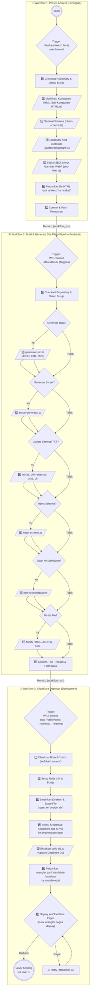

[](https://raw.githubusercontent.com/frijal/LayarKosong/main/sementara/prompt-edan.md)
[](https://www.google.com/preferences/source?q=dalam.web.id)
[](readme-en.md)

# 🚀 Panduan Membuat Static Site

Selamat datang! Panduan ini menjelaskan cara membangun situs statis yang cepat, ringan, dan **ter-deploy secara otomatis ke Cloudflare Pages** menggunakan repository **Layar Kosong**.

[](https://github.com/frijal/LayarKosong/fork)

Konsepnya sederhana: kamu cukup fokus menulis dan melakukan commit ke GitHub. Seluruh proses build, generate aset, pemrosesan artikel, hingga deployment ditangani otomatis oleh **GitHub Actions + Cloudflare Wrangler**.

**Fitur Utama:**

* **Direct Deploy:** Menggunakan Wrangler untuk melakukan deployment langsung tanpa branch perantara.
* **Search Engine:** Mesin pencarian client-side berperforma tinggi menggunakan data dari `artikel.json` dan Cloudflare D1.
* **Clean URLs:** Mendukung URL tanpa ekstensi `.html` untuk struktur navigasi yang lebih bersih.

---

## 🧠 Arsitektur Otomatisasi (CI/CD)

Bagaimana **Layar Kosong** mengubah draft artikel menjadi halaman yang siap dipublikasikan?

Pipeline berikut menggambarkan alur otomatis mulai dari proses artikel, build dan generate data, hingga deployment ke Cloudflare Pages.


```mermaid
graph TD
    %% ==========================================
    %% WORKFLOW 1: 🔄 PROSES ARTIKELX
    %% ==========================================
    subgraph WF1 ["🔄 Workflow 1: Proses ArtikelX (Persiapan)"]
        direction TB
        Start1(((Mulai))) --> Trig1{"Trigger:<br>Push (artikelx/*.html)<br>atau Manual"}
        Trig1 --> Check1["1️⃣ Checkout Repository & Setup Bun.js"]
        
        Check1 --> S_HTML[/"2️⃣ Modifikasi Komponen HTML (Edit-Komponen-HTML.ts)"/]
        S_HTML --> S_Clean[/"3️⃣ Sanitasi Schema (clean-schema.ts)"/]
        S_Clean --> S_Font[/"4️⃣ Lokalisasi Aset Eksternal (gantifontshighlight.ts)"/]
        S_Font --> S_SEO[/"5️⃣ Injeksi SEO, Mirror Gambar, WebP (seo-fixer.ts)"/]
        
        S_SEO --> Move["6️⃣ Pindahkan file HTML dari 'artikelx/' ke 'artikel/'"]
        Move --> Commit1["7️⃣ Commit & Push Perubahan"]
    end

    %% ==========================================
    %% WORKFLOW 2: ☢️ BUILD AND GENERATE
    %% ==========================================
    subgraph WF2 ["☢️ Workflow 2: Build & Generate Site Files (Pipeline Produksi)"]
        direction TB
        Trig2{"Trigger:<br>WF1 Sukses<br>atau Manual (Toggles)"}
        
        Trig2 --> Check2["1️⃣ Checkout Repository & Setup Bun.js"]
        Check2 --> Build1{"Generate Data?"}
        
        Build1 -- Ya --> S_Gen[/"2️⃣ generator-pro.ts<br>(JSON, XML, RSS)"/] --> Build2
        Build1 -- Tidak --> Build2{"Generate Srcset?"}
        
        S_Gen --> Build2
        Build2 -- Ya --> S_Srcset[/"3️⃣ srcset-generator.ts"/] --> Build3
        Build2 -- Tidak --> Build3{"Update Sitemap TXT?"}
        
        S_Srcset --> Build3
        Build3 -- Ya --> S_SiteTXT[/"4️⃣ koki.ts, bikin-sitemap-txt.ts, dll"/] --> Build4
        Build3 -- Tidak --> Build4{"Inject Schema?"}
        
        S_SiteTXT --> Build4
        Build4 -- Ya --> S_Inject[/"5️⃣ inject-schema.ts"/] --> Build5
        Build4 -- Tidak --> Build5{"Ubah ke Markdown?"}
        
        S_Inject --> Build5
        Build5 -- Ya --> S_MD[/"6️⃣ html-to-markdown.ts"/] --> Build6
        Build5 -- Tidak --> Build6{"Minify File?"}
        
        S_MD --> Build6
        Build6 -- Ya --> S_Min[/"7️⃣ Minify HTML, JSON & XML"/] --> Commit2
        Build6 -- Tidak --> Commit2["8️⃣ Commit, Pull --rebase & Push Data"]
    end

    %% ==========================================
    %% WORKFLOW 3: 🚀 CLOUDFLARE DEPLOYER
    %% ==========================================
    subgraph WF3 ["🚀 Workflow 3: Cloudflare Deployer (Deployment)"]
        direction TB
        Trig3{"Trigger:<br>WF2 Sukses<br>atau Push (Paths: _redirects, _headers)"}
        
        Trig3 --> Check3["1️⃣ Checkout Branch 'main' (ke folder 'source')"]
        Check3 --> Setup3["2️⃣ Setup Node v24 & Bun.js"]
        
        Setup3 --> Rsync["3️⃣ Bersihkan Direktori & Stage File<br>(rsync ke 'deploy_dir')"]
        
        Rsync --> Config["4️⃣ Injeksi Kredensial Cloudflare (D1 & KV)<br>ke /tmp/wrangler.toml"]
        
        Config --> D1Build[/"5️⃣ Eksekusi build-d1.ts (Update Database D1)"/]
        
        D1Build --> DeploySetup["6️⃣ Pindahkan 'wrangler.toml' dan folder 'functions'<br>ke root direktori"]
        
        DeploySetup --> Cloudflare{"7️⃣ Deploy ke Cloudflare Pages<br>(bunx wrangler pages deploy)"}
        
        Cloudflare -- "Berhasil" --> Success(((Layar Kosong<br>Go Live! 🎉)))
        Cloudflare -- "Gagal" --> Retry["⚠️ Retry (Maksimal 3x)"]
        Retry --> Cloudflare
    end

    %% ==========================================
    %% WORKFLOW HANDOFFS
    %% ==========================================
    Commit1 -- Memicu (workflow_run) --> Trig2
    Commit2 -- Memicu (workflow_run) --> Trig3
```

### 🛠️ Dapur Otomatisasi: Bun.js & TypeScript

Bagian berikut berisi implementasi yang menjalankan pipeline di atas. Seluruh script berada di direktori **`dapur/`**, sehingga nama **“dapur”** tetap digunakan sebagai bagian dari struktur repository.

<details>
<summary><strong>1️⃣ Script Tahap Persiapan (Proses ArtikelX)</strong></summary>

* [`Edit-Komponen-HTML.ts`](https://github.com/frijal/LayarKosong/blob/main/dapur/Edit-Komponen-HTML.ts) — Memodifikasi struktur dasar HTML agar sesuai dengan standar SEO.
* [`clean-schema.ts`](https://github.com/frijal/LayarKosong/blob/main/dapur/clean-schema.ts) — Membersihkan tag atau schema markup yang tidak diperlukan.
* [`gantifontshighlight.ts`](https://github.com/frijal/LayarKosong/blob/main/dapur/gantifontshighlight.ts) — Mengubah aset pihak ketiga seperti font dan CSS eksternal menjadi aset lokal.
* [`seo-fixer.ts`](https://github.com/frijal/LayarKosong/blob/main/dapur/seo-fixer.ts) — Menginjeksi metadata SEO, melakukan mirror gambar secara otomatis, dan mengonversi gambar ke WebP.

</details>

<details>
<summary><strong>2️⃣ Script Tahap Produksi (Build & Generate)</strong></summary>

* [`generator-pro.ts`](https://github.com/frijal/LayarKosong/blob/main/dapur/generator-pro.ts) — Generator utama untuk `artikel.json`, XML, dan RSS Feed.
* [`srcset-generator.ts`](https://github.com/frijal/LayarKosong/blob/main/dapur/srcset-generator.ts) — Menghasilkan varian gambar yang dioptimalkan untuk berbagai resolusi layar.
* **Toolchain Sitemap & Routing:** Mengelola pembuatan sitemap dan data routing melalui [`koki.ts`](https://github.com/frijal/LayarKosong/blob/main/dapur/koki.ts), [`bikin-sitemap-txt.ts`](https://github.com/frijal/LayarKosong/blob/main/dapur/bikin-sitemap-txt.ts), [`generate_llms.ts`](https://github.com/frijal/LayarKosong/blob/main/dapur/generate_llms.ts), dan [`redirectmap.ts`](https://github.com/frijal/LayarKosong/blob/main/dapur/redirectmap.ts).
* [`inject-schema.ts`](https://github.com/frijal/LayarKosong/blob/main/dapur/inject-schema.ts) — Menginjeksi structured data Schema.org untuk mendukung rich results di mesin pencari.
* [`html-to-markdown.ts`](https://github.com/frijal/LayarKosong/blob/main/dapur/html-to-markdown.ts) — Mengonversi dokumen HTML menjadi Markdown.
* **Minifier:** Melakukan minifikasi HTML, JSON, dan XML melalui [`minify-html.ts`](https://github.com/frijal/LayarKosong/blob/main/dapur/minify-html.ts) dan [`minify-jsonxml.ts`](https://github.com/frijal/LayarKosong/blob/main/dapur/minify-jsonxml.ts).

</details>

<details>
<summary><strong>3️⃣ Script Tahap Deployment (Cloudflare)</strong></summary>

* [`build-d1.ts`](https://github.com/frijal/LayarKosong/blob/main/search/build-d1.ts) — Membangun indeks pencarian dan memperbarui database Cloudflare D1.

</details>

---

## 🛠️ Tahap 1: Persiapan Environment (Git & Bun)

Pastikan **Git dan Bun** sudah terpasang sebelum menjalankan pipeline. Deployment menggunakan `bunx wrangler`.

* **Git:** [Download Git](https://git-scm.com/downloads), atau gunakan `winget install Git.Git` di Windows.
* **Bun:** [Panduan instalasi Bun](https://bun.sh/) — JavaScript runtime yang digunakan oleh build system.

### 🪟 Windows

Unduh dan instal Git dari [git-scm.com](https://git-scm.com/download/win).

Atau gunakan `winget`:

```bash
winget install --id Git.Git -e --source winget
```

### 🍎 macOS

Jika menggunakan Homebrew:

```bash
brew install git
```

### 🐧 Linux

* **Debian, Ubuntu, Linux Mint, MX Linux, Kali:**

  ```bash
  sudo apt update
  sudo apt install git
  ```

* **Fedora, Red Hat (RHEL), CentOS, AlmaLinux:**

  ```bash
  sudo dnf install git
  # atau untuk environment lama:
  sudo yum install git
  ```

* **Arch Linux, CachyOS, Manjaro, EndeavourOS:**

  ```bash
  sudo pacman -S git
  ```

* **NixOS:**

  Tambahkan `git` ke `environment.systemPackages` di `configuration.nix`, atau jalankan:

  ```bash
  nix-env -i git
  ```

* **OpenSUSE:**

  ```bash
  sudo zypper install git
  ```

---

## 🧬 Tahap 2: Setup Repository (Fork & Cloudflare)

### 1. Fork Repository

Lakukan **Fork** repository ini ke akun GitHub kamu.

Gunakan branch `main`. Branch `site` sudah tidak digunakan.

> 👉 **[Fork Repository](https://github.com/frijal/LayarKosong/fork)**

### 2. Buat Project Cloudflare Pages

1. Login ke [Cloudflare Dashboard](https://dash.cloudflare.com/).
2. Buka **Workers & Pages** > **Create application** > **Pages** > **Upload assets**.
3. Tentukan nama project, misalnya `blog-saya`.

### 3. Buat API Token

1. Buka **My Profile** > **API Tokens** > **Create Token**.
2. Gunakan template **Edit Cloudflare Workers** atau berikan akses yang diperlukan untuk **Cloudflare Pages** pada level account.
3. Simpan **Account ID** dan **API Token** secara aman.

> Jangan menyimpan kredensial tersebut di source code, workflow, atau file konfigurasi yang di-commit ke repository.

---

## 🏗️ Tahap 3: Konfigurasi Automation (GitHub Secrets)

Pipeline deployment membutuhkan kredensial Cloudflare untuk melakukan autentikasi dari GitHub Actions.

### 1. Bersihkan Sample Content 🧹

Sebelum mulai menggunakan repository:

* Hapus seluruh file di dalam folder `artikel/`.
* Hapus seluruh gambar di dalam folder `img/`.

### 2. Konfigurasi Repository Secrets

Tambahkan kredensial Cloudflare ke repository hasil fork:

1. Buka **Settings** > **Secrets and variables** > **Actions**.
2. Klik **New repository secret**.
3. Tambahkan dua secret berikut:

   * `CF_API_TOKEN`: API token Cloudflare.
   * `CF_ACCOUNT_ID`: Cloudflare Account ID.

> Simpan secret tersebut sebagai kredensial repository. Jangan hard-code nilainya ke dalam source code.

---

## ✍️ Tahap 4: Penulisan Konten & Production Pipeline

Pada tahap ini, kamu cukup menempatkan artikel pada direktori staging. Pipeline otomatis akan menangani proses berikutnya.

1. Buat file HTML artikel baru.
2. Tempatkan file tersebut di **`artikelx/`** — perhatikan akhiran `x`.
3. Jalankan `git commit` dan `git push` ke repository.
4. **GitHub Actions menjalankan pipeline secara otomatis:** file baru akan diproses untuk injeksi SEO, mirror gambar, konversi WebP, pembaruan sitemap, dan proses build lainnya.
5. Setelah diproses, file HTML dipindahkan dari `artikelx/` ke direktori production `artikel/`.

🎉 Setelah workflow selesai dan deployment berhasil, halaman tersebut tersedia di situs publik.

Untuk artikel berikutnya, ulangi workflow yang sama.

---

## 🎨 Tahap 5: Branding & Konfigurasi

Setelah deployment awal berhasil, sesuaikan konfigurasi repository agar identitas, domain, dan branding situs sesuai dengan kebutuhanmu.

### Konfigurasi Inti — Wajib Disesuaikan

* **`wrangler.toml`**: Ubah `name = "layarkosong"` menjadi nama project Cloudflare milikmu.
* **`artikel.json`**: File ini digunakan sebagai indeks utama untuk mesin pencari situs. Biarkan pipeline memperbaruinya secara otomatis.
* **Folder `ext/`**: Sesuaikan URL dan konfigurasi domain pada file-file di dalam direktori ini.

### Halaman Root & Identitas Situs

Sesuaikan informasi pada file-file berikut di root repository:

* `index.html` — Halaman utama.
* `search.html` — Halaman pencarian.
* `404.html` — Halaman not-found.
* `BingSiteAuth.xml` — Verifikasi Bing Webmaster.
* `CODE_OF_CONDUCT.md` — Kode etik repository.
* `data-deletion-form.html` & `data-deletion.html` — Halaman privasi dan penghapusan data.
* `disclaimer.html` & `disclaimer.md` — Disclaimer situs.
* `favicon.ico` / `favicon.png` / `favicon.svg` — Ikon situs.
* `feed.html` — Halaman RSS Feed terbaru.
* `img.html` — Galeri gambar.
* `robots.txt` — Instruksi untuk crawler mesin pencari.
* `sitemap.html` — Sitemap dalam format HTML.
* `thumbnail.jpg` / `thumbnail.png` / `thumbnail.webp` — Thumbnail default untuk social sharing.

### 🙏 Checklist Pra-Launch

* [ ] Ganti seluruh URL `dalam.web.id` dengan domain milikmu.
* [ ] Perbarui informasi kontak dan metadata.
* [ ] Sesuaikan warna, logo, dan branding.
* [ ] Validasi seluruh internal link.
* [ ] Verifikasi `sitemap` dan `robots.txt`.
* [ ] Pastikan deployment Cloudflare Pages berhasil.
* [ ] Verifikasi situs production melalui HTTPS.

---

## 🌐 Tahap 6: Custom Domain (Opsional)

Jika kamu memiliki domain sendiri dan tidak ingin menggunakan hostname bawaan Cloudflare Pages (`*.pages.dev`):

1. Tambahkan file `CNAME` di root repository.

2. Isi dengan domain milikmu, misalnya:

   ```text
   example.com
   ```

3. Konfigurasikan DNS melalui provider domain:

   * Tambahkan A record ke IP GitHub Pages jika menggunakan GitHub Pages.
   * Atau konfigurasi domain langsung melalui **Cloudflare Pages > Custom Domains** untuk integrasi dengan Cloudflare Pages.

> **Catatan:** Untuk deployment Cloudflare Pages, konfigurasi **Custom Domains** di Cloudflare Pages merupakan mekanisme yang relevan. File `CNAME` lebih umum digunakan pada workflow GitHub Pages.

---

## 💬 Butuh Bantuan?

Jika workflow gagal atau mengalami kendala saat melakukan konfigurasi Cloudflare, lihat repository asli dan gunakan halaman diskusinya untuk mendapatkan informasi atau melaporkan masalah.

> 👉 **[Diskusi di Repository LayarKosong](https://github.com/frijal/LayarKosong/discussions)**

---

## Lisensi

Lihat file [Lisensi](LICENSE) untuk informasi lengkap mengenai lisensi repository.

## Kontributor

Terima kasih kepada semua kontributor yang telah membantu mengembangkan proyek ini. 🙏

<p align="center"><a href="#top">(kembali ke atas)</a></p>

---

<details>
<summary>⚡ Klik untuk Status Teknis ⚙️</summary>

### 📊 Status & Stack

[](https://creativecommons.org/licenses/by/4.0/)
[](#readme)
[](#readme)
[](#readme)
[](https://dalam.web.id)
[](#readme)

[](#readme)
[](#readme)
[](#readme)
[](#readme)

**Otomatisasi & CI/CD:**

[](https://github.com/frijal/LayarKosong/actions/workflows/proses-artikelx.yml)
[](https://github.com/frijal/LayarKosong/actions/workflows/generate-json-xml.yml)
[](https://github.com/frijal/LayarKosong/actions/workflows/hapushitung.yml)
[](https://github.com/frijal/LayarKosong/actions/workflows/CloudflarePages.yml)

[](#readme)
[](#readme)
[](#readme)
[](#readme)
[](#readme)

**Stack:**

[](#readme)
[](#readme)
[](#readme)
[](#readme)
[](#readme)
[](#readme)
[](#readme)
[](#readme)
[](#readme)
[](#readme)

**Format Data:**

[](#readme)
[](#readme)
[](#readme)
[](#readme)

**Media Sosial:**

[](https://twitter.com/responaja)
[](https://threads.net/frijal)
[](https://tiktok.com/@gibah.dilarang)
[](https://linkedin.com/in/frijal)
[](https://facebook.com/frijal)
[](https://github.com/frijal)

**Dukungan AI:**

[](#readme)
[](#readme)
[](#readme)

</details>

---

## Container Image

[](https://github.com/frijal/LayarKosong/actions/workflows/Docker-Build-Layar-Kosong.yml)

[](https://github.com/frijal/layarkosong/pkgs/container/layarkosong)

```bash
docker pull ghcr.io/frijal/layarkosong:latest
```
