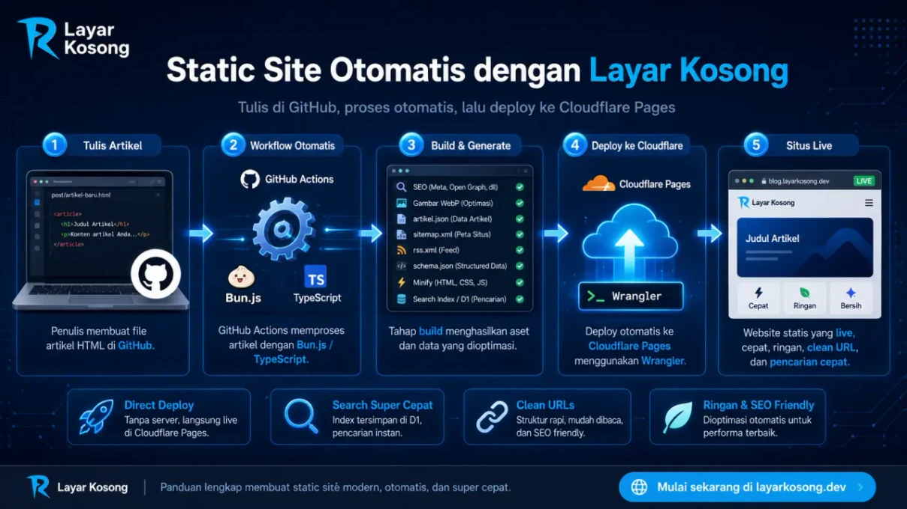

[](https://raw.githubusercontent.com/frijal/LayarKosong/main/sementara/prompt-edan.md)
[](https://www.google.com/preferences/source?q=dalam.web.id)
[](README.md)

# 🚀 Static Site Deployment Guide

[](https://github.com/frijal/LayarKosong/fork)

Welcome! This guide explains how to build a high-performance, lightweight static website with **automated deployment to Cloudflare Pages** using the **Layar Kosong** repository.

The core concept is simple: you focus on writing and committing content to GitHub, while **GitHub Actions + Cloudflare Wrangler** handle the build pipeline and publish your site to the internet automatically.

**Key Features:**

* **Direct Deploy:** Uses Wrangler for direct and fast deployment without an intermediate deployment branch.
* **Search Engine:** High-performance client-side JavaScript powered by `artikel.json` and Cloudflare D1.
* **Clean URLs:** Supports extensionless URLs (`.html` omitted) for cleaner and more readable navigation.

---

## 🧠 CI/CD Automation Architecture

Wondering how **Layar Kosong** transforms a raw article draft into a production-ready website? The following diagram illustrates the complete automated pipeline:

```mermaid
graph TD
    %% ==========================================
    %% WORKFLOW 1: 🔄 ARTIKELX PROCESSING
    %% ==========================================
    subgraph WF1 ["🔄 Workflow 1: ArtikelX Processing (Initial Preparation)"]
        direction TB
        Start1(((Start))) --> Trig1{"Trigger:<br>Push (artikelx/*.html)<br>or Manual"}
        Trig1 --> Check1["1️⃣ Checkout Repository & Setup Bun.js"]
        
        Check1 --> S_HTML[/"2️⃣ Modify HTML Components (Edit-Komponen-HTML.ts)"/]
        S_HTML --> S_Clean[/"3️⃣ Sanitize Schema (clean-schema.ts)"/]
        S_Clean --> S_Font[/"4️⃣ Localize External Assets (gantifontshighlight.ts)"/]
        S_Font --> S_SEO[/"5️⃣ Inject SEO, Mirror Images, Convert to WebP (seo-fixer.ts)"/]
        
        S_SEO --> Move["6️⃣ Move HTML files from 'artikelx/' to 'artikel/'"]
        Move --> Commit1["7️⃣ Commit & Push Changes"]
    end

    %% ==========================================
    %% WORKFLOW 2: ☢️ BUILD AND GENERATE
    %% ==========================================
    subgraph WF2 ["☢️ Workflow 2: Build & Generate Site Files (Production Pipeline)"]
        direction TB
        Trig2{"Trigger:<br>WF1 Success<br>or Manual (Toggles)"}
        
        Trig2 --> Check2["1️⃣ Checkout Repository & Setup Bun.js"]
        Check2 --> Build1{"Generate Data?"}
        
        Build1 -- Yes --> S_Gen[/"2️⃣ generator-pro.ts<br>(JSON, XML, RSS)"/] --> Build2
        Build1 -- No --> Build2{"Generate Srcset?"}
        
        S_Gen --> Build2
        Build2 -- Yes --> S_Srcset[/"3️⃣ srcset-generator.ts"/] --> Build3
        Build2 -- No --> Build3{"Update Sitemap TXT?"}
        
        S_Srcset --> Build3
        Build3 -- Yes --> S_SiteTXT[/"4️⃣ koki.ts, bikin-sitemap-txt.ts, etc."/] --> Build4
        Build3 -- No --> Build4{"Inject Schema?"}
        
        S_SiteTXT --> Build4
        Build4 -- Yes --> S_Inject[/"5️⃣ inject-schema.ts"/] --> Build5
        Build4 -- No --> Build5{"Convert to Markdown?"}
        
        S_Inject --> Build5
        Build5 -- Yes --> S_MD[/"6️⃣ html-to-markdown.ts"/] --> Build6
        Build5 -- No --> Build6{"Minify Files?"}
        
        S_MD --> Build6
        Build6 -- Yes --> S_Min[/"7️⃣ Minify HTML, JSON & XML"/] --> Commit2
        Build6 -- No --> Commit2["8️⃣ Commit, Pull --rebase & Push Data"]
    end

    %% ==========================================
    %% WORKFLOW 3: 🚀 CLOUDFLARE DEPLOYER
    %% ==========================================
    subgraph WF3 ["🚀 Workflow 3: Cloudflare Deployer (Public Release)"]
        direction TB
        Trig3{"Trigger:<br>WF2 Success<br>or Push (Paths: _redirects, _headers)"}
        
        Trig3 --> Check3["1️⃣ Checkout 'main' Branch (into 'source' directory)"]
        Check3 --> Setup3["2️⃣ Setup Node v24 & Bun.js"]
        
        Setup3 --> Rsync["3️⃣ Clean Directories & Stage Files<br>(rsync to 'deploy_dir')"]
        
        Rsync --> Config["4️⃣ Inject Cloudflare Credentials (D1 & KV)<br>into /tmp/wrangler.toml"]
        
        Config --> D1Build[/"5️⃣ Execute build-d1.ts (Update D1 Database)"/]
        
        D1Build --> DeploySetup["6️⃣ Move 'wrangler.toml' and 'functions'<br>into the root directory"]
        
        DeploySetup --> Cloudflare{"7️⃣ Deploy to Cloudflare Pages<br>(bunx wrangler pages deploy)"}
        
        Cloudflare -- "Success" --> Success(((Layar Kosong<br>Go Live! 🎉)))
        Cloudflare -- "Failure" --> Retry["⚠️ Retry (Maximum 3 Attempts)"]
        Retry --> Cloudflare
    end

    %% ==========================================
    %% WORKFLOW HANDOFFS
    %% ==========================================
    Commit1 -- Triggers (workflow_run) --> Trig2
    Commit2 -- Triggers (workflow_run) --> Trig3
```



### 🛠️ Automation Internals: Bun.js & TypeScript Scripts

Interested in the implementation behind the architecture above? The following links provide direct access to the scripts that power the automation pipeline:

<details>
<summary><strong>1️⃣ Preparation Stage Scripts (ArtikelX Processing)</strong></summary>

* [`Edit-Komponen-HTML.ts`](https://github.com/frijal/LayarKosong/blob/main/dapur/Edit-Komponen-HTML.ts) — Modifies the base HTML structure to comply with the site's SEO standards.
* [`clean-schema.ts`](https://github.com/frijal/LayarKosong/blob/main/dapur/clean-schema.ts) — Removes unnecessary or redundant tags and schema markup.
* [`gantifontshighlight.ts`](https://github.com/frijal/LayarKosong/blob/main/dapur/gantifontshighlight.ts) — Converts third-party assets such as fonts and external CSS into local assets.
* [`seo-fixer.ts`](https://github.com/frijal/LayarKosong/blob/main/dapur/seo-fixer.ts) — Injects SEO metadata, automatically mirrors images, and converts images to WebP.

</details>

<details>
<summary><strong>2️⃣ Production Stage Scripts (Build & Generate)</strong></summary>

* [`generator-pro.ts`](https://github.com/frijal/LayarKosong/blob/main/dapur/generator-pro.ts) — Core generator for `artikel.json`, XML files, and RSS feeds.
* [`srcset-generator.ts`](https://github.com/frijal/LayarKosong/blob/main/dapur/srcset-generator.ts) — Generates optimized image variants for different screen resolutions.
* **Sitemap & Redirect Bundle:** Generates sitemap data and routing metadata ([`koki.ts`](https://github.com/frijal/LayarKosong/blob/main/dapur/koki.ts), [`bikin-sitemap-txt.ts`](https://github.com/frijal/LayarKosong/blob/main/dapur/bikin-sitemap-txt.ts), [`generate_llms.ts`](https://github.com/frijal/LayarKosong/blob/main/dapur/generate_llms.ts), [`redirectmap.ts`](https://github.com/frijal/LayarKosong/blob/main/dapur/redirectmap.ts)).
* [`inject-schema.ts`](https://github.com/frijal/LayarKosong/blob/main/dapur/inject-schema.ts) — Injects Schema.org structured data for enhanced search-engine metadata and rich results.
* [`html-to-markdown.ts`](https://github.com/frijal/LayarKosong/blob/main/dapur/html-to-markdown.ts) — Converts HTML documents into Markdown.
* **Minifiers:** High-performance file compressors for HTML, JSON, and XML ([`minify-html.ts`](https://github.com/frijal/LayarKosong/blob/main/dapur/minify-html.ts), [`minify-jsonxml.ts`](https://github.com/frijal/LayarKosong/blob/main/dapur/minify-jsonxml.ts)).

</details>

<details>
<summary><strong>3️⃣ Deployment Stage Scripts (Cloudflare)</strong></summary>

* [`build-d1.ts`](https://github.com/frijal/LayarKosong/blob/main/search/build-d1.ts) — Builds the search index and updates the Cloudflare D1 database.

</details>

---

## 🛠️ Stage 1: Environment Preparation (Git & Bun)

The first requirement is to have **Git and Bun installed**, as the deployment process uses `bunx wrangler`.

* **Git:** [Download Git](https://git-scm.com/downloads) or install it using `winget install Git.Git` on Windows.
* **Bun:** [Bun installation guide](https://bun.sh/) — a fast JavaScript runtime used by the build system.

### 🪟 Windows

Download and install the official package from [git-scm.com](https://git-scm.com/download/win).

Alternatively, install Git using `winget`:

```bash
winget install --id Git.Git -e --source winget
```

### 🍎 macOS

Open Terminal and run the following command if you are using Homebrew:

```bash
brew install git
```

### 🐧 Linux

* **Debian, Ubuntu, Linux Mint, MX Linux, Kali:**

  ```bash
  sudo apt update
  sudo apt install git
  ```

* **Fedora, Red Hat (RHEL), CentOS, AlmaLinux:**

  ```bash
  sudo dnf install git
  # or for older environments:
  sudo yum install git
  ```

* **Arch Linux, CachyOS, Manjaro, EndeavourOS:**

  ```bash
  sudo pacman -S git
  ```

* **NixOS:**

  Add `git` to `environment.systemPackages` in `configuration.nix`, or run:

  ```bash
  nix-env -i git
  ```

* **OpenSUSE:**

  ```bash
  sudo zypper install git
  ```

---

## 🧬 Stage 2: Repository Setup (Fork & Cloudflare)

### 1. Fork the Repository

Fork this repository into your own GitHub account.

Only the `main` branch is required; the legacy `site` branch is no longer used.

> 👉 **[Fork the Repository](https://github.com/frijal/LayarKosong/fork)**

### 2. Create a Cloudflare Pages Project

1. Log in to the [Cloudflare Dashboard](https://dash.cloudflare.com/).
2. Navigate to **Workers & Pages** > **Create application** > **Pages** > **Upload assets**.
3. Assign a project name, for example `my-blog`.

### 3. Create a Cloudflare API Token

1. Open **My Profile** > **API Tokens** > **Create Token**.
2. Use the **Edit Cloudflare Workers** template or configure the token with access to **Cloudflare Pages** at the account level.
3. Store your **Account ID** and **API Token** securely.

---

## 🏗️ Stage 3: Automation Configuration (GitHub Secrets)

The deployment pipeline requires Cloudflare credentials to authenticate GitHub Actions.

### 1. Remove the Sample Content 🧹

Clean the repository before publishing your own content:

* Delete all files inside the `artikel/` directory.
* Delete all images inside the `img/` directory.

### 2. Configure Repository Secrets

Add your Cloudflare credentials to the forked repository:

1. Open **Settings** > **Secrets and variables** > **Actions**.
2. Click **New repository secret**.
3. Add the following secrets:

   * `CF_API_TOKEN`: Your Cloudflare API token.
   * `CF_ACCOUNT_ID`: Your Cloudflare account ID.

> Keep these credentials private. Do not hard-code them into source files, workflow definitions, or committed configuration.

---

## ✍️ Stage 4: Content Authoring & Production

This is where the automated content pipeline takes over.

You do not need to place article files directly into the public production directory. Instead, use the `artikelx/` staging directory.

1. Create a new HTML article.
2. Place the file inside **`artikelx/`** — note the trailing `x`.
3. Run `git commit` and `git push` to your repository.
4. **Let GitHub Actions handle the pipeline:** The workflow detects the new article, processes SEO metadata, generates WebP assets, updates sitemap data, and moves the processed file into the production `artikel/` directory.

🎉 **Done!** Your page is now processed and deployed to the public site.

Repeat the same workflow for subsequent articles.

---

## 🎨 Stage 5: Branding & Configuration

After the initial deployment succeeds, customize the repository so that the generated site represents your own domain, identity, and branding.

### Core Configuration — Required

* **`wrangler.toml`**: Change `name = "layarkosong"` to your Cloudflare project name.
* **`artikel.json`**: This file powers the site's search index. Let the automation pipeline update it automatically.
* **`ext/` directory**: Update URLs and domain-specific configuration throughout the files in this directory.

### Root-Level Pages & Site Identity

Review and customize the following files in the repository root:

* `index.html` — Main landing page.
* `search.html` — Search interface.
* `404.html` — Custom not-found page.
* `BingSiteAuth.xml` — Bing Webmaster verification.
* `CODE_OF_CONDUCT.md` — Repository code of conduct.
* `data-deletion-form.html` & `data-deletion.html` — Privacy and data-deletion pages.
* `disclaimer.html` & `disclaimer.md` — Site disclaimer.
* `favicon.ico` / `favicon.png` / `favicon.svg` — Site icons.
* `feed.html` — Latest RSS feed page.
* `img.html` — Image gallery.
* `robots.txt` — Search-engine crawler directives.
* `sitemap.html` — HTML sitemap.
* `thumbnail.jpg` / `thumbnail.png` / `thumbnail.webp` — Default social-sharing thumbnails.

### 🙏 Pre-Launch Checklist

* [ ] Replace all `dalam.web.id` URLs with your own domain.
* [ ] Update contact information and metadata.
* [ ] Customize colors, logo, and branding.
* [ ] Validate all internal links.
* [ ] Verify `sitemap` and `robots.txt`.
* [ ] Confirm Cloudflare Pages deployment succeeds.
* [ ] Verify the production site over HTTPS.

---

## 🌐 Stage 6: Custom Domain (Optional)

If you have your own domain and do not want to use the default Cloudflare Pages hostname (`*.pages.dev`):

1. Add a `CNAME` file to the repository root.

2. Set its content to your domain, for example:

   ```text
   example.com
   ```

3. Configure DNS with your domain provider:

   * Add an A record to GitHub Pages IP addresses if you are using GitHub Pages.
   * Or configure the domain directly through **Cloudflare Pages > Custom Domains** for a native Cloudflare Pages integration.

> **Note:** If the site is deployed to Cloudflare Pages, the Cloudflare Pages **Custom Domains** configuration is generally the relevant deployment path. A `CNAME` file is primarily associated with GitHub Pages workflows.

---

## 💬 Need Help?

If the workflow fails or you encounter problems configuring Cloudflare, refer to the original repository and its discussion area.

> 👉 **[Discuss on the LayarKosong Repository](https://github.com/frijal/LayarKosong/discussions)**

---

## License

See the [License](LICENSE) file for licensing information.

## Contributors

Thank you to everyone who has contributed to this project. 🙏

<p align="center"><a href="#top">(Back to top)</a></p>

---

<details>
<summary>⚡ Click for Technical Status ⚙️</summary>

### 📊 Status & Stack

[](https://creativecommons.org/licenses/by/4.0/)
[](#readme)
[](#readme)
[](#readme)
[](https://dalam.web.id)
[](#readme)

[](#readme)
[](#readme)
[](#readme)
[](#readme)

**Automation & CI/CD:**

[](https://github.com/frijal/LayarKosong/actions/workflows/proses-artikelx.yml)
[](https://github.com/frijal/LayarKosong/actions/workflows/generate-json-xml.yml)
[](https://github.com/frijal/LayarKosong/actions/workflows/hapushitung.yml)
[](https://github.com/frijal/LayarKosong/actions/workflows/CloudflarePages.yml)

[](#readme)
[](#readme)
[](#readme)
[](#readme)
[](#readme)

**Stack:**

[](#readme)
[](#readme)
[](#readme)
[](#readme)
[](#readme)
[](#readme)
[](#readme)
[](#readme)
[](#readme)
[](#readme)

**Data Formats:**

[](#readme)
[](#readme)
[](#readme)
[](#readme)

**Social Media:**

[](https://twitter.com/responaja)
[](https://threads.net/frijal)
[](https://tiktok.com/@gibah.dilarang)
[](https://linkedin.com/in/frijal)
[](https://facebook.com/frijal)
[](https://github.com/frijal)

**AI Tooling:**

[](#readme)
[](#readme)
[](#readme)

</details>

---

## Container Image

[](https://github.com/frijal/LayarKosong/actions/workflows/Docker-Build-Layar-Kosong.yml)

[](https://github.com/frijal/layarkosong/pkgs/container/layarkosong)

```bash
docker pull ghcr.io/frijal/layarkosong:latest
```
