[](https://raw.githubusercontent.com/frijal/LayarKosong/main/sementara/prompt-edan.md)
[](https://www.google.com/preferences/source?q=dalam.web.id)

# 🚀 Static Site Generation Guide

[](https://github.com/frijal/LayarKosong/fork)

Welcome! This guide will help you build a blazing-fast, lightweight static site that **automatically deploys to Cloudflare Pages** using the **Layar Kosong** repository.

The concept: You just focus on writing in GitHub, and let **GitHub Actions + Cloudflare Wrangler** handle pushing your articles to the internet instantly.

**Key Features:**
* **Direct Deploy:** Uses Wrangler for rapid delivery without intermediary branches.
* **Search Engine:** Blazing-fast *client-side JavaScript* powered by data from `artikel.json` & Cloudflare D1.
* **Clean URLs:** Supports extensionless URLs for more elegant and clean navigation.

---

## 🧠 Automation Architecture (CI/CD)

Curious how "Layar Kosong" transforms your raw drafts into a *live* site? Here's the automated relay workflow:

```mermaid
graph TD
    %% ==========================================
    %% WORKFLOW 1: 🔄 ARTICLE PROCESSING
    %% ==========================================
    subgraph WF1 ["🔄 Workflow 1: ArtikelX Processing (Initial Preparation)"]
        direction TB
        Start1(((Start))) --> Trig1{"Trigger:<br>Push (artikelx/*.html)<br>or Manual"}
        Trig1 --> Check1["1️⃣ Checkout Repo & Setup Bun.js"]
        
        Check1 --> S_HTML[/"2️⃣ Edit HTML Components (Edit-Komponen-HTML.ts)"/]
        S_HTML --> S_Clean[/"3️⃣ Sterilize Schema (clean-schema.ts)"/]
        S_Clean --> S_Font[/"4️⃣ Swap Assets to Local (gantifontshighlight.ts)"/]
        S_Font --> S_SEO[/"5️⃣ SEO Injection, Mirror, WebP (seo-fixer.ts)"/]
        
        S_SEO --> Move["6️⃣ Move HTML files from 'artikelx/' to 'artikel/'"]
        Move --> Commit1["7️⃣ Commit & Push Changes"]
    end

    %% ==========================================
    %% WORKFLOW 2: ☢️ BUILD AND GENERATE
    %% ==========================================
    subgraph WF2 ["☢️ Workflow 2: Build & Generate Site Files (Production Factory)"]
        direction TB
        Trig2{"Trigger:<br>WF1 Success<br>or Manual (Toggles)"}
        
        Trig2 --> Check2["1️⃣ Checkout Repo & Setup Bun.js"]
        Check2 --> Build1{"Generate Data?"}
        
        Build1 -- Yes --> S_Gen[/"2️⃣ generator-pro.ts<br>(JSON, XML, RSS)"/] --> Build2
        Build1 -- No --> Build2{"Generate Srcset?"}
        
        S_Gen --> Build2
        Build2 -- Yes --> S_Srcset[/"3️⃣ srcset-generator.ts"/] --> Build3
        Build2 -- No --> Build3{"Update Sitemap TXT?"}
        
        S_Srcset --> Build3
        Build3 -- Yes --> S_SiteTXT[/"4️⃣ koki.ts, bikin-sitemap-txt.ts, etc."/] --> Build4
        Build3 -- No --> Build4{"Inject Schema?"}
        
        S_SiteTXT --> Build4
        Build4 -- Yes --> S_Inject[/"5️⃣ inject-schema.ts"/] --> Build5
        Build4 -- No --> Build5{"Convert to Markdown?"}
        
        S_Inject --> Build5
        Build5 -- Yes --> S_MD[/"6️⃣ html-to-markdown.ts"/] --> Build6
        Build5 -- No --> Build6{"Minify Files?"}
        
        S_MD --> Build6
        Build6 -- Yes --> S_Min[/"7️⃣ Minify HTML, JSON & XML"/] --> Commit2
        Build6 -- No --> Commit2["8️⃣ Commit, Pull --rebase & Push Data"]
    end

    %% ==========================================
    %% WORKFLOW 3: 🚀 CLOUDFLARE DEPLOYER
    %% ==========================================
    subgraph WF3 ["🚀 Workflow 3: Cloudflare Deployer (Public Launch)"]
        direction TB
        Trig3{"Trigger:<br>WF2 Success<br>or Push (Paths: _redirects, _headers)"}
        
        Trig3 --> Check3["1️⃣ Checkout 'main' Branch (to 'source' folder)"]
        Check3 --> Setup3["2️⃣ Setup Node v24 & Bun.js"]
        
        Setup3 --> Rsync["3️⃣ Clean Directory & Move Files<br>(rsync to 'deploy_dir')"]
        
        Rsync --> Config["4️⃣ Inject Cloudflare Credentials (D1 & KV)<br>to /tmp/wrangler.toml"]
        
        Config --> D1Build[/"5️⃣ Execute build-d1.ts (Update D1 Database)"/]
        
        D1Build --> DeploySetup["6️⃣ Move 'wrangler.toml' and 'functions' folder<br>to root directory"]
        
        DeploySetup --> Cloudflare{"7️⃣ Deploy to Cloudflare Pages<br>(bunx wrangler pages deploy)"}
        
        Cloudflare -- "Success" --> Success(((Layar Kosong<br>Go Live! 🎉)))
        Cloudflare -- "Failed" --> Retry["⚠️ Retry (Max 3x)"]
        Retry --> Cloudflare
    end

    %% ==========================================
    %% CONNECTIONS (RELAY)
    %% ==========================================
    Commit1 -- Triggers (workflow_run) --> Trig2
    Commit2 -- Triggers (workflow_run) --> Trig3
```



### 🛠️ The Secret Kitchen: Automation Scripts (Bun.js & TypeScript)

Want to peek under the hood at the code behind the architecture above? Here are direct links to the driving scripts:

<details>
<summary><strong>1️⃣ Preparation Stage Scripts (ArtikelX Processing)</strong></summary>

- [`Edit-Komponen-HTML.ts`](https://github.com/frijal/LayarKosong/blob/main/dapur/Edit-Komponen-HTML.ts) — Modifies the base HTML structure to comply with SEO standards.
- [`clean-schema.ts`](https://github.com/frijal/LayarKosong/blob/main/dapur/clean-schema.ts) — Removes unnecessary tags or *schema markup*.
- [`gantifontshighlight.ts`](https://github.com/frijal/LayarKosong/blob/main/dapur/gantifontshighlight.ts) — Pulls *third-party* assets (fonts, external CSS) into local assets.
- [`seo-fixer.ts`](https://github.com/frijal/LayarKosong/blob/main/dapur/seo-fixer.ts) — SEO meta injection, automatic image *mirroring*, and WebP conversion.
</details>

<details>
<summary><strong>2️⃣ Production Stage Scripts (Build & Generate)</strong></summary>

- [`generator-pro.ts`](https://github.com/frijal/LayarKosong/blob/main/dapur/generator-pro.ts) — The main brain behind `artikel.json`, XML, and RSS Feed generation.
- [`srcset-generator.ts`](https://github.com/frijal/LayarKosong/blob/main/dapur/srcset-generator.ts) — Optimizes image sizes for various screen resolutions.
- **Sitemap & Redirect Bundle:** The sitemap and routing generation squad ([`koki.ts`](https://github.com/frijal/LayarKosong/blob/main/dapur/koki.ts), [`bikin-sitemap-txt.ts`](https://github.com/frijal/LayarKosong/blob/main/dapur/bikin-sitemap-txt.ts), [`generate_llms.ts`](https://github.com/frijal/LayarKosong/blob/main/dapur/generate_llms.ts), [`redirectmap.ts`](https://github.com/frijal/LayarKosong/blob/main/dapur/redirectmap.ts)).
- [`inject-schema.ts`](https://github.com/frijal/LayarKosong/blob/main/dapur/inject-schema.ts) — Injects *Schema.org* markup for Google *rich snippets*.
- [`html-to-markdown.ts`](https://github.com/frijal/LayarKosong/blob/main/dapur/html-to-markdown.ts) — Converts HTML format to Markdown.
- **Minifier:** High-performance file compressors for lightning-fast <em>load</em> times ([`minify-html.ts`](https://github.com/frijal/LayarKosong/blob/main/dapur/minify-html.ts), [`minify-jsonxml.ts`](https://github.com/frijal/LayarKosong/blob/main/dapur/minify-jsonxml.ts)).
</details>

<details>
<summary><strong>3️⃣ Deploy Stage Scripts (Cloudflare)</strong></summary>

- [`build-d1.ts`](https://github.com/frijal/LayarKosong/blob/main/search/build-d1.ts) — Builds the search index and pushes it to the Cloudflare D1 Database.
</details>

---

## 🛠️ Stage 1: Environment Setup (Git & Bun)

First step: **Make sure Git and Bun are installed** since we'll be using the `bunx wrangler` command.

* **Git:** [Download here](https://git-scm.com/downloads) (Or use `winget install Git.Git` on Windows).
* **Bun:** [Installation guide here](https://bun.sh/) (Ultra-fast runtime replacement for Node.js).

### 🪟 Windows
Download and install the official installer from [git-scm.com](https://git-scm.com/download/win). Just "Next, Next, Finish"!
Or you can use winget:
```bash
winget install --id Git.Git -e --source winget
```

### 🍎 macOS
Open Terminal and run the following command (if using Homebrew):
```bash
brew install git
```

### 🐧 Linux

* **Debian, Ubuntu, Linux Mint, MX Linux, Kali:**
  ```bash
  sudo apt update
  sudo apt install git
  ```
* **Fedora, Red Hat (RHEL), CentOS, AlmaLinux:**
  ```bash
  sudo dnf install git
  # or for older versions:
  sudo yum install git
  ```
* **Arch Linux, CachyOS, Manjaro, EndeavourOS:**
  ```bash
  sudo pacman -S git
  ```
* **NixOS:**
  Add `git` to `environment.systemPackages` in `configuration.nix` or run:
  ```bash
  nix-env -i git
  ```
* **OpenSUSE:**
  ```bash
  sudo zypper install git
  ```

---

## 🧬 Stage 2: Repository Setup (Fork & Cloudflare)

1. **Fork the Repository:** *Fork* this repository to your account. Just check the `main` branch only (we no longer need the `site` branch).
> 👉 **[Click here to Fork the Repo](https://github.com/frijal/LayarKosong/fork)**


2. **Register on Cloudflare Pages:**
* Log in to the [Cloudflare](https://dash.cloudflare.com/) dashboard.
* Select **Workers & Pages** > **Create application** > **Pages** > **Upload assets**.
* Name your project (e.g., `my-blog`).


3. **Get API Token:**
* Go to **My Profile** > **API Tokens** > **Create Token**.
* Use the "Edit Cloudflare Workers" *template* or grant access to *Account: Cloudflare Pages*.
* Save your **Account ID** and **API Token**.

---

## 🏗️ Stage 3: Automation (GitHub Secrets)

Now it's time to clean up and start preparing the pipeline.

### 1. Clean Up Old Content 🧹
Delete all default sample files to keep your site clean:
* Delete everything inside the `artikel/` folder.
* Delete all images inside the `img/` folder.

### 2. Install Secret Keys
For GitHub to automatically push files to Cloudflare, add your credentials to the forked repo:
1. Go to the **Settings** > **Secrets and variables** > **Actions** tab in your GitHub repository.
2. Click **New repository secret** and add these two secrets:
   * `CF_API_TOKEN`: (Fill in with your Cloudflare API token).
   * `CF_ACCOUNT_ID`: (Fill in with your Cloudflare account ID).

---

## ✍️ Stage 4: Start Writing and Producing

This is where the magic happens. You don't need to manually place files in the public folder — just follow this "kitchen" workflow:

1. Create your new HTML article file.
2. Place the file into the **`artikelx/`** folder (note the 'x' suffix).
3. Run `git commit` and `git push` to the repository.
4. **Let the Action Work:** The automated *workflow* will detect the new file, process it (SEO injection, webp, sitemap, etc.), and move it to the main showcase ready for publishing!

🎉 **Done!** Your first page is now live across the globe. Repeat this step for subsequent articles.

---

## 🎨 Stage 5: Identity Personalization & Configuration

After a successful test run, it's time to claim this site as fully yours. Don't forget to change the following data so your SEO and site identity are relevant.

### Core Configuration (Must Change)
* **`wrangler.toml`**: Change `name = "layarkosong"` to your Cloudflare project name.
* **`artikel.json`**: This is the lifeblood of your blog's search engine — let the system update it automatically.
* **`ext/` folder**: Adjust the URL and domain name in all configuration files inside this folder.

### Root Pages (Customize Your Identity)
Edit and customize the information in the following files located at the main page (*root*):
- `index.html` - Homepage.
- `search.html` - Search page.
- `404.html` - Page for broken/not-found URLs.
- `BingSiteAuth.xml` - Bing Webmaster verification.
- `CODE_OF_CONDUCT.md` - Repository code of conduct.
- `data-deletion-form.html` & `data-deletion.html` - Privacy & data deletion related pages.
- `disclaimer.html` & `disclaimer.md` - Site disclaimer.
- `favicon.ico` / `favicon.png` / `favicon.svg` - Site icon.
- `feed.html` - Latest RSS Feed page.
- `img.html` - Image gallery.
- `robots.txt` - Instructions for search engine *crawlers*.
- `sitemap.html` - Table of Contents / Sitemap.
- `thumbnail.jpg` / `thumbnail.png` / `thumbnail.webp` - Default thumbnail for *social share*.

### 🙏 Pre-Launch Checklist
- [ ] Replace all URLs from `dalam.web.id` to your domain.
- [ ] Update contact information and metadata.
- [ ] Adjust colors, logo, and *branding*.
- [ ] Test all internal links.
- [ ] Verify `sitemap` and `robots.txt`.

---

## 🌐 Stage 6: Custom Domain (Optional)

If you have your own domain and don't want to use the default Cloudflare Pages URL (`*.pages.dev`):

1. Add a `CNAME` file to the repository root.
2. Fill it with your domain name (e.g., `example.com`).
3. Configure DNS at your domain *provider*:
   - Add an A *record* to GitHub Pages IPs (if using Pages).
   - Or simply configure it directly via the **Cloudflare Pages > Custom Domains** dashboard for the smoothest integration.

---

## 💬 Need Help?

If the *workflow* gets stuck or you're confused about Cloudflare setup, head straight to the original repository.

> 👉 **[Discuss at the LayarKosong Repository](https://github.com/frijal/LayarKosong/discussions)**

---

## License

Please check the [License](LICENSE) file in the repository for licensing information.

## Contributors

Thanks to everyone who has contributed to this page. 🙏

<p align="center"><a href="#top">(back to top)</a></p>

---

<details>
<summary>⚡ Click for Technical Status ⚙️</summary>

### 📊 Status & Stack:

[](https://creativecommons.org/licenses/by/4.0/)
[](#readme)
[](#readme)
[](#readme)
[](https://dalam.web.id)
[](#readme)

[](#readme)
[](#readme)
[](#readme)
[](#readme)

**Automation & CI/CD:**

[](https://github.com/frijal/LayarKosong/actions/workflows/proses-artikelx.yml)
[](https://github.com/frijal/LayarKosong/actions/workflows/generate-json-xml.yml)
[](https://github.com/frijal/LayarKosong/actions/workflows/hapushitung.yml)
[](https://github.com/frijal/LayarKosong/actions/workflows/CloudflarePages.yml)

[](#readme)
[](#readme)
[](#readme)
[](#readme)
[](#readme)

**Stack:**

[](#readme)
[](#readme)
[](#readme)
[](#readme)
[](#readme)
[](#readme)
[](#readme)
[](#readme)
[](#readme)
[](#readme)

**Data Formats:**

[](#readme)
[](#readme)
[](#readme)
[](#readme)

**Social Media:**

[](https://twitter.com/responaja)
[](https://threads.net/frijal)
[](https://tiktok.com/@gibah.dilarang)
[](https://linkedin.com/in/frijal)
[](https://facebook.com/frijal)
[](https://github.com/frijal)

**AI Support:**

[](#readme)
[](#readme)
[](#readme)

</details>

---

## Container Image

[](https://github.com/frijal/LayarKosong/actions/workflows/Docker-Build-Layar-Kosong.yml)

[](https://github.com/frijal/layarkosong/pkgs/container/layarkosong)

```bash
docker pull ghcr.io/frijal/layarkosong:latest
```
