# 🚀 Static Site Deployment Guide

Welcome. This guide outlines the implementation setup for building a lightweight, high-performance static site with automated continuous deployment to **Cloudflare Pages** using the **Layar Kosong** repository infrastructure.

The architecture decouples content authoring from site generation: author content via Git commits, while **GitHub Actions + Cloudflare Wrangler** manage the end-to-end build pipeline, static asset generation, and edge deployment automatically.

**Core Features:**

* **Direct Deployment:** Zero-friction edge delivery via Cloudflare Wrangler without intermediate deployment branches.
* **Client-Side Search:** High-speed client-side querying powered by `artikel.json` and Cloudflare D1.
* **Clean URLs:** Extensionless path handling (sans `.html`) for streamlined routing.

---

## 🧠 CI/CD Pipeline Architecture

Below is the execution flow detailing how raw markdown and HTML sources are ingested, transformed, and published to production:

```mermaid
graph TD
    %% ==========================================
    %% WORKFLOW 1: 🔄 ARTICLE PREPARATION PIPELINE
    %% ==========================================
    subgraph WF1 ["🔄 Workflow 1: Article Pre-processing Pipeline"]
        direction TB
        Start1(((Start))) --> Trig1{"Trigger:<br>Push (artikelx/*.html)<br>or Manual Dispatch"}
        Trig1 --> Check1["1️⃣ Checkout Repository & Initialize Bun Runtime"]
        
        Check1 --> S_HTML[/"2️⃣ Parse & Standardize HTML (Edit-Komponen-HTML.ts)"/]
        S_HTML --> S_Clean[/"3️⃣ Sanitize & Sterilize Schemas (clean-schema.ts)"/]
        S_Clean --> S_Font[/"4️⃣ Localize Remote Assets (gantifontshighlight.ts)"/]
        S_Font --> S_SEO[/"5️⃣ Inject SEO Metadata, Image Mirrors & WebP (seo-fixer.ts)"/]
        
        S_SEO --> Move["6️⃣ Relocate Processed Assets: 'artikelx/' -> 'artikel/'"]
        S_Move --> Commit1["7️⃣ Commit & Push Staged Changes"]
    end

    %% ==========================================
    %% WORKFLOW 2: ☢️ BUILD & ASSET GENERATION
    %% ==========================================
    subgraph WF2 ["☢️ Workflow 2: Site Compilation & Generation"]
        direction TB
        Trig2{"Trigger:<br>WF1 Completion<br>or Manual Dispatch"}
        
        Trig2 --> Check2["1️⃣ Checkout Repository & Initialize Bun Runtime"]
        Check2 --> Build1{"Generate Indexes?"}
        
        Build1 -- Yes --> S_Gen[/"2️⃣ generator-pro.ts<br>(JSON, XML, RSS Manifests)"/] --> Build2
        Build1 -- No --> Build2{"Generate Responsive Srcset?"}
        
        S_Gen --> Build2
        Build2 -- Yes --> S_Srcset[/"3️⃣ srcset-generator.ts"/] --> Build3
        Build2 -- No --> Build3{"Update Sitemap Manifests?"}
        
        S_Srcset --> Build3
        Build3 -- Yes --> S_SiteTXT[/"4️⃣ koki.ts, bikin-sitemap-txt.ts, etc."/] --> Build4
        Build3 -- No --> Build4{"Inject Structured Data?"}
        
        S_SiteTXT --> Build4
        Build4 -- Yes --> S_Inject[/"5️⃣ inject-schema.ts"/] --> Build5
        Build4 -- No --> Build5{"Transpile to Markdown?"}
        
        S_Inject --> Build5
        Build5 -- Yes --> S_MD[/"6️⃣ html-to-markdown.ts"/] --> Build6
        Build5 -- No --> Build6{"Minify Production Assets?"}
        
        S_MD --> Build6
        Build6 -- Yes --> S_Min[/"7️⃣ Minify HTML, JSON & XML Artifacts"/] --> Commit2
        Build6 -- No --> Commit2["8️⃣ Commit, Pull --rebase & Push Assets"]
    end

    %% ==========================================
    %% WORKFLOW 3: 🚀 CLOUDFLARE EDGE DEPLOYER
    %% ==========================================
    subgraph WF3 ["🚀 Workflow 3: Edge Deployment Engine"]
        direction TB
        Trig3{"Trigger:<br>WF2 Completion<br>or Target File Modification (_redirects, _headers)"}
        
        Trig3 --> Check3["1️⃣ Checkout 'main' Branch (to 'source' workspace)"]
        Check3 --> Setup3["2️⃣ Provision Node.js v24 & Bun Runtimes"]
        
        Setup3 --> Rsync["3️⃣ Clean Workspace & Stage Target Files<br>(rsync to 'deploy_dir')"]
        
        Rsync --> Config["4️⃣ Inject Cloudflare Credentials (D1 & KV)<br>to /tmp/wrangler.toml"]
        
        Config --> D1Build[/"5️⃣ Execute build-d1.ts (Update Edge Database D1)"/]
        
        D1Build --> DeploySetup["6️⃣ Stage 'wrangler.toml' & 'functions/' directory<br>to project root"]
        
        DeploySetup --> Cloudflare{"7️⃣ Deploy Assets to Cloudflare Pages<br>(bunx wrangler pages deploy)"}
        
        Cloudflare -- "Success" --> Success(((Layar Kosong<br>Live in Production 🎉)))
        Cloudflare -- "Failure" --> Retry["⚠️ Retry Execution (Max 3 attempts)"]
        Retry --> Cloudflare
    end

    %% ==========================================
    %% PIPELINE DISPATCH DEPENDENCIES
    %% ==========================================
    Commit1 -- Triggers (workflow_run) --> Trig2
    Commit2 -- Triggers (workflow_run) --> Trig3

```



### 🛠️ Execution Scripts Reference (Bun.js & TypeScript)

Below are the underlying TypeScript automation scripts executing within the execution pipeline:

* [`Edit-Komponen-HTML.ts`](https://github.com/frijal/LayarKosong/blob/main/dapur/Edit-Komponen-HTML.ts) — Enforces SEO structural standards across raw HTML files.
* [`clean-schema.ts`](https://github.com/frijal/LayarKosong/blob/main/dapur/clean-schema.ts) — Sanitizes and strips unneeded DOM nodes or malformed schema tags.
* [`gantifontshighlight.ts`](https://github.com/frijal/LayarKosong/blob/main/dapur/gantifontshighlight.ts) — Fetches and localizes external third-party assets (web fonts, stylesheets) for offline-first rendering.
* [`seo-fixer.ts`](https://github.com/frijal/LayarKosong/blob/main/dapur/seo-fixer.ts) — Injects dynamic meta tags, mirrors external media assets, and handles lossy WebP image compression.

* [`generator-pro.ts`](https://github.com/frijal/LayarKosong/blob/main/dapur/generator-pro.ts) — Core indexing engine producing `artikel.json`, sitemaps, and RSS/XML feeds.
* [`srcset-generator.ts`](https://github.com/frijal/LayarKosong/blob/main/dapur/srcset-generator.ts) — Compiles dynamic image set attributes optimized for cross-device viewports.
* **Sitemap & Routing Engine:** Automates manifest compilation and edge pathing ([`koki.ts`](https://github.com/frijal/LayarKosong/blob/main/dapur/koki.ts), [`bikin-sitemap-txt.ts`](https://github.com/frijal/LayarKosong/blob/main/dapur/bikin-sitemap-txt.ts), [`generate_llms.ts`](https://github.com/frijal/LayarKosong/blob/main/dapur/generate_llms.ts), [`redirectmap.ts`](https://github.com/frijal/LayarKosong/blob/main/dapur/redirectmap.ts)).
* [`inject-schema.ts`](https://github.com/frijal/LayarKosong/blob/main/dapur/inject-schema.ts) — Integrates structured Schema.org JSON-LD definitions for enhanced Google rich snippets.
* [`html-to-markdown.ts`](https://github.com/frijal/LayarKosong/blob/main/dapur/html-to-markdown.ts) — Converts HTML content into structured Markdown files.
* **Minification Engine:** High-ratio asset minification for minimal load latency ([`minify-html.ts`](https://github.com/frijal/LayarKosong/blob/main/dapur/minify-html.ts), [`minify-jsonxml.ts`](https://github.com/frijal/LayarKosong/blob/main/dapur/minify-jsonxml.ts)).

* [`build-d1.ts`](https://github.com/frijal/LayarKosong/blob/main/search/build-d1.ts) — Generates and syncs the client search index directly to Cloudflare D1 SQL storage.

---

## 🛠️ Step 1: Environment Setup (Git & Bun)

Verify that **Git** and **Bun** are installed locally to support `bunx wrangler` tooling.

* **Git:** [Download binary distributions](https://git-scm.com/downloads) (or execute `winget install Git.Git` on Windows).
* **Bun:** [Installation Guide](https://bun.sh/) (Ultra-fast JavaScript/TypeScript runtime replacing Node.js).

### 🪟 Windows

Execute the standard installer from [git-scm.com](https://git-scm.com/download/win), or run via Windows Package Manager:

```bash
winget install --id Git.Git -e --source winget

```

### 🍎 macOS

Install via Homebrew:

```bash
brew install git

```

### 🐧 Linux

* **Debian / Ubuntu / Linux Mint / Arch-based:**
```bash
sudo apt update && sudo apt install git

```


* **Fedora / RHEL / CentOS:**
```bash
sudo dnf install git

```


* **Arch Linux / CachyOS / Manjaro:**
```bash
sudo pacman -S git

```


* **NixOS:**
Include `git` within `environment.systemPackages` inside `configuration.nix`, or run:
```bash
nix-env -i git

```


* **openSUSE:**
```bash
sudo zypper install git

```


---

## 🧬 Step 2: Repository & Cloudflare Provisioning

1. **Fork the Repository:** Fork this repository into your account workspace. Sync the `main` branch only.

> 👉 **[Fork Repository](https://github.com/frijal/LayarKosong/fork)**

2. **Provision Cloudflare Pages:**

* Access the [Cloudflare Dashboard](https://dash.cloudflare.com/).
* Navigate to **Workers & Pages** > **Create application** > **Pages** > **Upload assets**.
* Assign a project identifier (e.g., `my-static-blog`).

3. **Generate API Credentials:**

* Go to **My Profile** > **API Tokens** > **Create Token**.
* Apply the **Edit Cloudflare Workers** template or grant permissions scoped to **Account: Cloudflare Pages**.
* Record your **Account ID** and **API Token**.

---

## 🏗️ Step 3: CI/CD Secrets Setup

### 1. Purge Boilerplate Content 🧹

Reset the default content state before initial deployment:

* Flush all target artifacts inside the `artikel/` directory.
* Remove image assets inside `img/`.

### 2. Configure GitHub Action Secrets

Store your target deployment credentials inside repository variables:

1. Navigate to **Settings** > **Secrets and variables** > **Actions** within your repository.
2. Select **New repository secret** and define the following entries:
* `CF_API_TOKEN`: Cloudflare API Token value.
* `CF_ACCOUNT_ID`: Cloudflare Account ID value.


---

## ✍️ Step 4: Content Authoring Workflow

Follow this staging flow to trigger automated deployments:

1. Draft your target article in valid HTML format.
2. Commit the new entry into the **`artikelx/`** staging directory.
3. Push changes via `git commit` and `git push`.
4. **Automated Pipeline Handling:** The pipeline automatically intercepts the push, triggers pre-processing (SEO injection, WebP encoding, manifest mapping), and promotes the finished file to the production path!

---

## 🎨 Step 5: Configuration & Customization

Update key configuration files to align site metadata and SEO endpoints with your domain.

### Core System Configuration (Mandatory)

* **`wrangler.toml`**: Update `name = "layarkosong"` to your Cloudflare project name.
* **`artikel.json`**: Real-time search index maintained automatically by the pipeline.
* **`ext/` Directory**: Update base domain references across all configuration templates inside this directory.

### Root Infrastructure Components

Modify site identity configuration files within the root path:

* `index.html` - Root landing page.
* `search.html` - Client-side search interface.
* `404.html` - Fallback route error handler.
* `BingSiteAuth.xml` - Bing Webmaster validation manifest.
* `CODE_OF_CONDUCT.md` - Repository governance guidelines.
* `data-deletion-form.html` & `data-deletion.html` - Privacy and compliance handlers.
* `disclaimer.html` & `disclaimer.md` - Site liability terms.
* `favicon.ico` / `favicon.png` / `favicon.svg` - Site favicons.
* `feed.html` - RSS reader landing index.
* `img.html` - Media asset browser interface.
* `robots.txt` - Search engine crawler directive policy.
* `sitemap.html` - Visual site map directory.
* `thumbnail.jpg` / `thumbnail.png` / `thumbnail.webp` - Default OpenGraph fallback assets.

### Pre-Flight Checklist

* [ ] Replace default domain references (`dalam.web.id`) with your custom domain.
* [ ] Update site metadata, maintainer contact endpoints, and legal directives.
* [ ] Customize stylesheet variables, logos, and UI asset bindings.
* [ ] Test internal hyperlinking integrity and dynamic routing rules.
* [ ] Validate generated `sitemap.xml` and `robots.txt` endpoints.

---

## 🌐 Step 6: Custom Domain Routing (Optional)

If routing traffic through a custom apex or subdomain instead of `*.pages.dev`:

1. Create a `CNAME` asset in the root directory.
2. Declare your domain target (e.g., `example.com`).
3. Update DNS record settings via your registrar:
* Configure custom domain routing directly inside **Cloudflare Pages > Custom Domains** for native edge SSL management and proxying.


---

## 💬 Issue Tracking & Discussions

For build failures, deployment pipeline bugs, or architecture questions, open an issue on the upstream repository:

> 👉 **[LayarKosong Discussions Platform](https://github.com/frijal/LayarKosong/discussions)**

---

## License

Refer to the [LICENSE](https://www.google.com/search?q=LICENSE) file for repository rights and distribution terms.

## Contributors

Thank you to all project contributors. 🙏

---

### 📊 System Status & Stack Specs:

**Automation & CI/CD Pipelines:**

**Core Technology Stack:**

**Data Specs & Storage Schemas:**

**Syndication & Profiles:**

**AI Tooling Support:**

---

## Container Image

```bash
docker pull ghcr.io/frijal/layarkosong:latest

```
